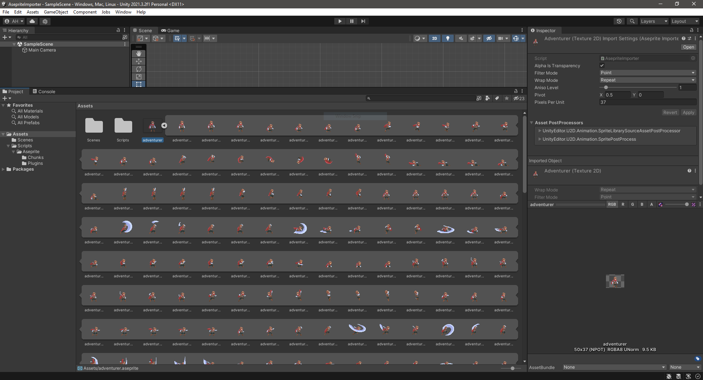

# AsepriteImporter [WIP]

**WORK IN PROGRESS**

## Overview

`.aseprite` file importer for Unity3D.

## Features

- [x] Prototype
- [ ] Start working on "real" features
  - [ ] Color depth
    - [x] 32bit RGBA
    - [ ] 16bit Grayscale
    - [ ] 8bit Indexed
  - [ ] Layer
    - [x] Visibility
    - [ ] Blend mode
      - [x] Normal
      - [ ] Multiply
      - [ ] Screen
      - [ ] Overlay
      - [ ] Darken
      - [ ] Lighten
      - [ ] Color dodge
      - [ ] Color burn
      - [ ] Hard light
      - [ ] Soft light
      - [ ] Difference
      - [ ] Exclusion
      - [ ] Hue
      - [ ] Saturation
      - [ ] Color
      - [ ] Luminosity
      - [ ] Addition
      - [ ] Subtract
      - [ ] Divide
    - [ ] Opacity
  - [ ] Cel
    - [ ] Data
      - [ ] Raw image data (uncompressed)
      - [ ] Linked cel
      - [x] Compressed image
      - [ ] Compressed tilemap
  - [ ] Split sprite
    - [x] One sprite per frame
    - [ ] One sprite per layer
  - [ ] Frames? (frame duration?)
  - [ ] Tags? (auto export animation clip? or custom `ScriptableObject`?)

## Credits

Using Unity [Scripted Importers](https://docs.unity3d.com/Manual/ScriptedImporters.html) API.

`.aseprite` file binary format specification: https://github.com/aseprite/aseprite/blob/main/docs/ase-file-specs.md

`ZLibStream` implementation is from [r2d2rigo/dotnetzip-for-unity](https://github.com/r2d2rigo/dotnetzip-for-unity).

Sample `.aseprite` file in the screenshot is
from [Animated Pixel Adventurer by rvros](https://rvros.itch.io/animated-pixel-hero) (slightly modified because linked
cels and indexed color mode are not supported yet).
